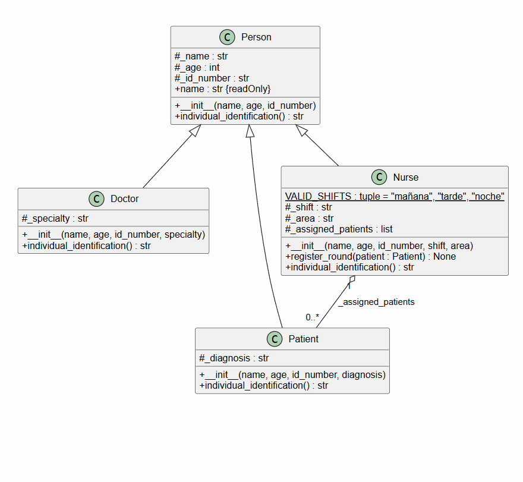

# Diagramas UML: Sistema Hospitalario

Este documento explica los diagramas de clases UML del proyecto, que modela un pequeño sistema hospitalario en Python dividido en cuatro ejercicios: `exercise1` (polimorfismo con personas), `exercise2` (paciente con estado restringido), `exercise3` (medicamentos y fórmula) y `exercise4` (exámenes de laboratorio). Cada ejercicio extiende las clases del anterior.

## Ejercicio 1:

### 1. Visión general

El ejercicio muestra el polimorfismo: una lista de objetos de distintos tipos se recorre llamando al mismo método, `individual_identification()`, y cada objeto responde de forma diferente.

- `main_exercise1()` en `main.py` crea los objetos y los recorre en una lista.
- `Person` es la clase base con los datos comunes.
- `Doctor`, `Patient` y `Nurse` heredan de `Person` y sobrescriben `individual_identification()`.

### 2. Explicación de cada clase

#### `Person`
Representa a una persona genérica del hospital. Guarda:

- `_name`, `_age` y `_id_number`: nombre, edad y documento de identidad.

Expone la propiedad de solo lectura `name` y el método `individual_identification()`, que retorna el nombre y el documento.

#### `Doctor`
Representa a un médico. Guarda:

- `_specialty: str`: la especialidad médica.

Sobrescribe `individual_identification()` para incluir el prefijo "Dr." y la especialidad.

#### `Patient`
Representa a un paciente. Guarda:

- `_diagnosis: str`: el diagnóstico actual.

Sobrescribe `individual_identification()` para incluir el diagnóstico.

#### `Nurse`
Representa a un enfermero. Guarda:

- `VALID_SHIFTS`: atributo de clase con los turnos permitidos `"mañana"`, `"tarde"`, `"noche"`.
- `_shift` y `_area`: turno y área de trabajo.
- `_assigned_patients: list`: pacientes bajo su cuidado.

Lanza `ValueError` si el turno no es válido. El método `register_round(patient)` agrega un paciente a la lista e imprime una confirmación. Sobrescribe `individual_identification()` para mostrar área, turno y cantidad de pacientes.

### 3. Explicación de las relaciones

| Relación | Tipo | Significado |
|---|---|---|
| `Person ◁── Doctor` | Herencia | `Doctor` extiende de `Person` y sobrescribe `individual_identification()`. |
| `Person ◁── Patient` | Herencia | `Patient` extiende de `Person` y sobrescribe `individual_identification()`. |
| `Person ◁── Nurse` | Herencia | `Nurse` extiende de `Person` y sobrescribe `individual_identification()`. |
| `Nurse ◇── Patient` (`_assigned_patients`, `0..*`) | Agregación | `Nurse` guarda una lista de pacientes, pero los pacientes existen independientemente del enfermero. |

---