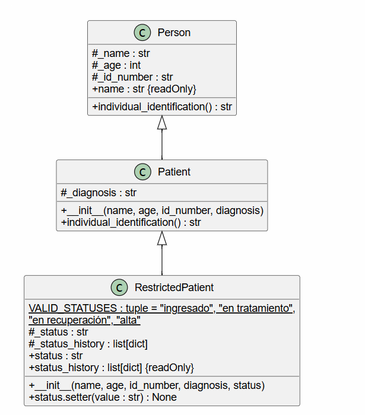

# Diagramas UML: Sistema Hospitalario

Este documento explica los diagramas de clases UML del proyecto, que modela un pequeño sistema hospitalario en Python dividido en cuatro ejercicios: `exercise1` (polimorfismo con personas), `exercise2` (paciente con estado restringido), `exercise3` (medicamentos y fórmula) y `exercise4` (exámenes de laboratorio). Cada ejercicio extiende las clases del anterior.

## Ejercicio 2:

### 1. Visión general

El ejercicio protege el estado clínico de un paciente: solo se aceptan valores de un conjunto permitido, la entrada se normaliza y cada cambio queda registrado en un historial.

- `main_exercise2()` prueba un caso válido con espacios y mayúsculas, un estado inexistente y un tipo incorrecto.
- `RestrictedPatient` hereda de `Patient` del ejercicio 1 y agrega la validación mediante una propiedad con *setter*.

### 2. Explicación de cada clase

#### `RestrictedPatient`
Representa un paciente cuyo estado clínico está restringido. Guarda:

- `VALID_STATUSES`: atributo de clase con los estados permitidos `"ingresado"`, `"en tratamiento"`, `"en recuperación"`, `"alta"`.
- `_status: str`: estado clínico actual.
- `_status_history: list[dict]`: historial de cambios, con `timestamp`, `previous` y `new`.

El *setter* de `status`:

- lanza `TypeError` si el valor no es una cadena,
- normaliza con `strip()` y `lower()`,
- lanza `ValueError` si el estado normalizado no está en `VALID_STATUSES`,
- registra el cambio en el historial.

La propiedad `status_history` retorna una copia de la lista, para que no se pueda modificar desde afuera.

### 3. Explicación de las relaciones

| Relación | Tipo | Significado |
|---|---|---|
| `Person ◁── Patient` | Herencia | Clases heredadas del ejercicio 1, mostradas como contexto. |
| `Patient ◁── RestrictedPatient` | Herencia | `RestrictedPatient` extiende de `Patient` y le agrega el estado restringido. |

---