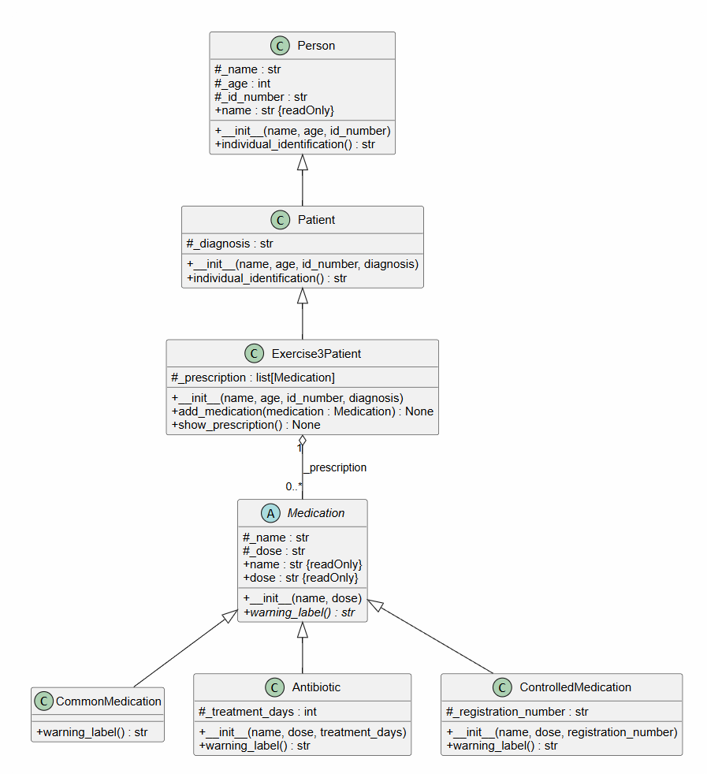

# Diagramas UML: Sistema Hospitalario

Este documento explica los diagramas de clases UML del proyecto, que modela un pequeño sistema hospitalario en Python dividido en cuatro ejercicios: `exercise1` (polimorfismo con personas), `exercise2` (paciente con estado restringido), `exercise3` (medicamentos y fórmula) y `exercise4` (exámenes de laboratorio). Cada ejercicio extiende las clases del anterior.

## Ejercicio 3:

### 1. Visión general

El ejercicio modela medicamentos de distintos tipos mediante una clase abstracta y los asocia a la fórmula de un paciente. Cada tipo de medicamento define su propia advertencia.

- `main_exercise3()` verifica que `Medication` no se pueda instanciar, prueba los casos inválidos y muestra la fórmula.
- `Medication` es la clase abstracta que usa `ABC` y `@abstractmethod`.
- `CommonMedication`, `Antibiotic` y `ControlledMedication` son las clases concretas.
- `Exercise3Patient` es el paciente que guarda la fórmula.

### 2. Explicación de cada clase

#### `Medication` (clase abstracta)
Representa un medicamento genérico. Guarda:

- `_name` y `_dose`: nombre y dosis indicada.

Expone las propiedades de solo lectura `name` y `dose`, y define el método abstracto `warning_label()`, que cada subclase debe implementar.

#### `CommonMedication`
Medicamento de venta libre. No agrega atributos. `warning_label()` retorna una cadena vacía porque no requiere aviso.

#### `Antibiotic`
Antibiótico con duración de tratamiento. Guarda:

- `_treatment_days: int`: días que debe completarse el tratamiento.

Lanza `TypeError` si no es un entero, excluyendo `bool`, y `ValueError` si no es positivo. `warning_label()` indica completar todos los días de tratamiento.

#### `ControlledMedication`
Medicamento de venta controlada. Guarda:

- `_registration_number: str`: número de registro oficial, obligatorio.

Lanza `TypeError` si no es una cadena y `ValueError` si está vacío. `warning_label()` indica que requiere receta oficial y muestra el registro.

#### `Exercise3Patient`
Paciente que hereda de `Patient` y agrega:

- `_prescription: list[Medication]`: la fórmula del paciente.

`add_medication(medication)` lanza `TypeError` si el objeto no es un `Medication`. `show_prescription()` imprime cada medicamento y, debajo, su advertencia solo si no está vacía.

### 3. Explicación de las relaciones

| Relación | Tipo | Significado |
|---|---|---|
| `Person ◁── Patient` | Herencia | Clases heredadas del ejercicio 1, mostradas como contexto. |
| `Patient ◁── Exercise3Patient` | Herencia | `Exercise3Patient` extiende de `Patient` y agrega la fórmula. |
| `Medication ◁── CommonMedication` | Herencia | Implementa `warning_label()` retornando una cadena vacía. |
| `Medication ◁── Antibiotic` | Herencia | Implementa `warning_label()` con los días de tratamiento. |
| `Medication ◁── ControlledMedication` | Herencia | Implementa `warning_label()` con la receta y el registro. |
| `Exercise3Patient ◇── Medication` (`_prescription`, `0..*`) | Agregación | El paciente guarda una lista de medicamentos; los medicamentos existen de forma independiente. |

---