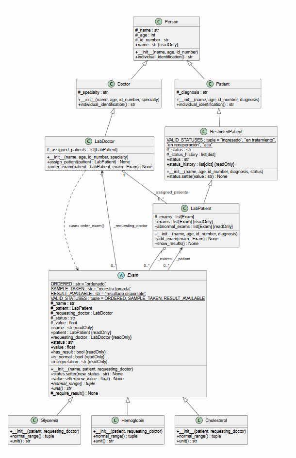

# Diagramas UML: Sistema Hospitalario

Este documento explica los diagramas de clases UML del proyecto, que modela un pequeño sistema hospitalario en Python dividido en cuatro ejercicios: `exercise1` (polimorfismo con personas), `exercise2` (paciente con estado restringido), `exercise3` (medicamentos y fórmula) y `exercise4` (exámenes de laboratorio). Cada ejercicio extiende las clases del anterior.

## Ejercicio 4: Exámenes de laboratorio

### 1. Visión general

El ejercicio modela exámenes de laboratorio que avanzan por tres estados en orden estricto: `ordenado` → `muestra tomada` → `resultado disponible`. Un médico solo puede ordenar exámenes a pacientes que tiene asignados.

- `main_exercise4()` prueba el ciclo completo del examen, las transiciones inválidas y la detección de exámenes alterados.
- `Exam` es la clase abstracta; `Glycemia`, `Hemoglobin` y `Cholesterol` son las concretas.
- `LabDoctor` y `LabPatient` extienden los roles de los ejercicios anteriores.
- `ExamStateError` es la excepción propia del ejercicio.

### 2. Explicación de cada clase

#### `Exam` (clase abstracta)
Representa un examen de laboratorio. Guarda:

- `ORDERED`, `SAMPLE_TAKEN`, `RESULT_AVAILABLE` y `VALID_STATUSES`: constantes de clase con los estados.
- `_name`, `_patient`, `_requesting_doctor`: nombre, paciente y médico que lo ordenó.
- `_status`: estado actual, que inicia en `ordenado`.
- `_value`: resultado numérico, `None` mientras no exista.

Lanza `TypeError` si el paciente no es `LabPatient` o el médico no es `LabDoctor`. Sus propiedades principales son:

- `status` (con *setter*): solo avanza un paso a la vez; lanza `ExamStateError` si salta, retrocede o repite.
- `value` (con *setter*): lanza `ExamStateError` si aún no se tomó la muestra y, al cargar el valor desde `muestra tomada`, pasa solo a `resultado disponible`.
- `has_result`, `is_normal` e `interpretation`: consultas sobre el resultado.

Define los métodos abstractos `normal_range()` y `unit()`, y el método protegido `_require_result()`.

#### `Glycemia`, `Hemoglobin` y `Cholesterol`
Exámenes concretos. Cada uno implementa `normal_range()` y `unit()`:

| Examen | Rango normal | Unidad |
|---|---|---|
| `Glycemia` | 70 a 100 | mg/dL |
| `Hemoglobin` | 12 a 16 | g/dL |
| `Cholesterol` | 0 a 200 | mg/dL |

#### `LabPatient`
Hereda de `RestrictedPatient` y agrega:

- `_exams: list[Exam]`: exámenes ordenados al paciente.

Expone `exams` y `abnormal_exams` correspondiente a exámenes con resultado fuera del rango, ignorando los que no tienen valor. `add_exam(exam)` valida el tipo y `show_results()` imprime cada examen con su valor o con su estado.

#### `LabDoctor`
Hereda de `Doctor` y agrega:

- `_assigned_patients: list[LabPatient]`: pacientes bajo su responsabilidad.

`assign_patient(patient)` asigna al paciente si todavía no lo tiene. `order_exam(patient, exam)` lanza `ValueError` si el paciente no está asignado o si el examen pertenece a otro paciente u otro médico, y `TypeError` si el paciente no es `LabPatient`.

#### `ExamStateError`
Excepción propia, hija de `Exception`, que se lanza cuando una operación no es válida para el estado del examen.

### 3. Explicación de las relaciones

| Relación | Tipo | Significado |
|---|---|---|
| `Person ◁── Doctor`, `Person ◁── Patient` | Herencia | Clases heredadas del ejercicio 1, mostradas como contexto. |
| `Patient ◁── RestrictedPatient` | Herencia | Clase heredada del ejercicio 2, mostrada como contexto. |
| `RestrictedPatient ◁── LabPatient` | Herencia | `LabPatient` agrega la lista de exámenes. |
| `Doctor ◁── LabDoctor` | Herencia | `LabDoctor` agrega pacientes asignados y la orden de exámenes. |
| `Exam ◁── Glycemia / Hemoglobin / Cholesterol` | Herencia | Cada examen implementa `normal_range()` y `unit()`. |
| `LabDoctor ◇── LabPatient` (`_assigned_patients`, `0..*`) | Agregación | El médico guarda los pacientes que tiene a cargo. |
| `LabPatient ◇── Exam` (`_exams`, `0..*`) | Agregación | El paciente guarda los exámenes que le ordenaron. |
| `Exam ──▶ LabPatient` (`_patient`) | Asociación | Cada examen conoce al paciente al que pertenece. |
| `Exam ──▶ LabDoctor` (`_requesting_doctor`) | Asociación | Cada examen conoce al médico que lo ordenó. |
| `LabDoctor ┄▶ Exam` (`use`) | Dependencia | `order_exam()` recibe y usa un `Exam` sin guardarlo como atributo del médico. |